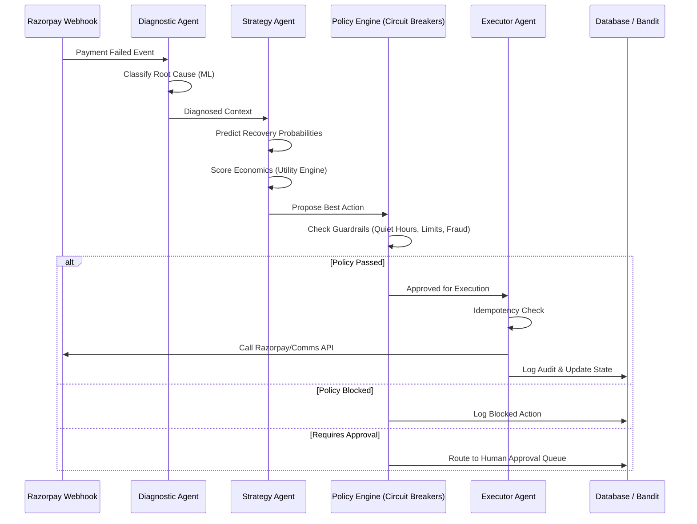

# RecoverOS Architecture

RecoverOS is designed as a modular, agentic pipeline. It separates decision-making (Agents & ML) from safety enforcement (Policy Engine & Idempotency) and execution (Services).

## System Flow



## 1. The Agents

RecoverOS uses four logical agents, orchestrated sequentially rather than as a free-roaming LLM swarm. This ensures deterministic financial behavior.

1. **Diagnostic Agent (`diagnostic_agent.py`)**: 
   - Takes a raw failure event.
   - Maps bank error codes to one of 9 semantic root causes (e.g., `BANK_DOWNTIME`, `INSUFFICIENT_FUNDS`) using a deterministic classifier.
   - Gathers customer history and fatigue scores.
2. **Strategy Agent (`strategy_agent.py`)**: 
   - The "brain". It calls the ML models.
   - Generates candidate actions (`retry_now`, `payment_link`, etc.).
   - Computes expected net revenue for all actions and ranks them.
   - Recommends the highest-utility action.
3. **Executor Agent (`executor_agent.py`)**: 
   - The "hands".
   - Enforces Idempotency (prevent duplicate charges).
   - Enforces Merchant Policy (Circuit Breakers).
   - If clear, routes the command to the appropriate service adapter (Mock Razorpay, mock SMS, etc.).
   - Generates strict audit logs.
4. **Learning Agent (`learning_agent.py`)**: 
   - Runs asynchronously after outcomes are resolved.
   - Updates the Contextual Bandit state based on success/failure, feeding back into future Strategy Agent decisions.

## 2. Machine Learning & Math

### Recovery Predictor
A Scikit-Learn `GradientBoostingClassifier` trained on historical synthetic data.
- **Inputs**: Root cause, customer segment, lifetime value, previous success rate, time of day.
- **Output**: Calibrated probability `P(recovery | action)`.

### Utility Engine (Recovery Economics)
Instead of just picking the highest probability, RecoverOS optimizes for Net Revenue:
```text
Expected Gross = P(recovery) * Transaction Amount
Expected Net = Expected Gross - Communication Cost - Discount Cost - (Fatigue Penalty)
```

### Contextual Bandit
Used to balance Exploration vs Exploitation. If we always pick the model's top choice, we never learn if new strategies work. The bandit uses Thompson Sampling (Beta distributions) per segment/action pair to occasionally try sub-optimal actions and learn their true conversion rate.

## 3. Safety & Policy (Circuit Breakers)

The LLM/ML models **cannot** execute actions directly. All proposed actions must pass the `circuit_breaker.py`, which checks:
1. **Fraud Flag**: Is `root_cause == SUSPECTED_FRAUD`? (Hard block)
2. **Quiet Hours**: Is the current time between 10 PM and 8 AM? (Blocks SMS/WhatsApp, allows silent background retries).
3. **Fatigue Limits**: Has the customer been contacted > 5 times in 72 hours?
4. **Retry Limits**: Has this specific payment been retried > 3 times?
5. **Approval Threshold**: Is the amount > ₹50,000? (Routes to Human Approval).
